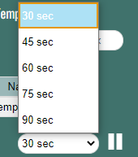
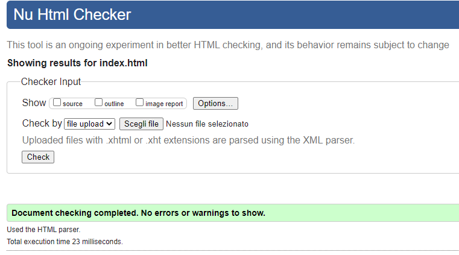

# Progetto Weather Station

---

# Introduction
> This program outputs a list of stations with their real-time data, such as temperature and images.
  You can configure the program by using the settings menu.

---

## Approach to solution / Project description
1) Design the structure of the website, starting with first-mobile and then with desktop. We used Adobe XD to design it.
    
2) Planning some functionalities at the beginning
3) Connect html with JS and with CSS
4) Add reset.css, in order to have a full control of the design
3) Start with coding the structure with html and css
4) First request in Ajax 
5) Populate the div with the response of the request
6) Develop filters, sorting and update
7) Protect with IIFE
8) JsBlob
9) Add feedbacks
10) We tested the entire program looking for possible bugs to fix by using the console
11) We tested the program with different browser every time we change something in the code
12) We improve the design look of the program
13) Clean all the code
14) Validate html and css
15) Generate JSdoc

---

## Files and project structure

**`animation.js`**
This file contains all the animations

**`control.js`**
This file contains all the controls to do

**`dom.js`**
This file contains all the dom

**`events.js`**
This file contains all the events

**`filters.js`**
This file contains all the filters situated in the settings

**`main.js`**
This file contains the main of the program

**`model.js`**
This file contains the model of a station

**`request.js`**
This file contains the requests in AJAX

**`sorting.js`**
This file contains the sorting filter, by name or temperature

---

## Configuration and technical characteristics
 The user of this program can filter the list of stations:
 - by name (search bar)
 - by country (settings menu)
 - by temperature (settings menu)
 
The user can sort the list of stations:
- by name (settings menu)
- by temperature (settings menu)

The user can setup the timer update as well, or can either pause it or reactivate it, and it will be visible the last update in the settings menu.

---

## Usage 
 The weather-station program starts with 30 sec of updating the data, by default.

- The user can change it by clicking the settings button and by choosing one of the options available:
  - 30 sec (default)
  - 45 sec 
  - 60 sec
  - 75 sec
  - 90 sec

  You will see a visible feedback of the updated data, thanks to the animations of the flags.

  

- By clicking a **station**, you can visualize more information about it, such as:
    - the image of the station
    - the humidity of the station
    - the wind of the station
    - the google maps link of the station

- The temperature degree is visible by the color:
  - '< 10': Blue
  - '< 15': Light-blue
  - '< 20' : Orange
  - '< 25': Dark-orange
  - '> 25': red
  - 'N.D.': Gray

    

---
## Browser compatibility
 - Google Chrome
 - Safari
 - Mozilla Firefox
 - Microsoft EDGE
 - IE11 (does not work properly, because of the grid)
 - Opera

---
## Version
 - 0.1 : design structure with html and css
 - 0.2 : receiving data and populating it in div's
 - 0.3 : fix structure and add icons
 - 0.4 : settings menu, filters and sorting functionalities
 - 0.5 : design, maps, temperature colored
 - 0.6 : feedbacks, grid, update functionality
 - 0.7 : fix update and sorting functionalities
 - 0.8 : implemented image lazy loading, tried possible bugs
 - 0.9 : design changed, fixed bugs, clear the console, added more feedbacks
 - **`1.0 : released (29/09/2020)`**

## Possible bugs - we did not fix them
- The user is allowed to write spaces on the search bar, on the first position and more then one between words
- The user is allowed to write letters in Safari and Firefox, in the temperature inputs

## Technologies
Project is created with:
+ Visual Studio Code version: 1.43.1

---
## Authors - TEAM
>GROUP 6

+ **Khazour Rania** (Project Manager)

+ **Rossi Francesco** (Project Manager)

+ **Munteanu Adrian** (Front-End Developer)

+ **Birgu Adrian** (Front-End Developer)

*NOTE*: We used the **Peer Programming Method** and **GitHub**

---
## Validation
Validated HTML

Validated CSS

---
## License and contact information
*This software is a freeware*

 Contact:
- rania.khazour@edu.itspiemonte.it
- francesco.rossi@edu.itspiemonte.it
- adrian.munteanu@edu.itspiemonte.it
- adrian.birgu@edu.itspiemonte.it

